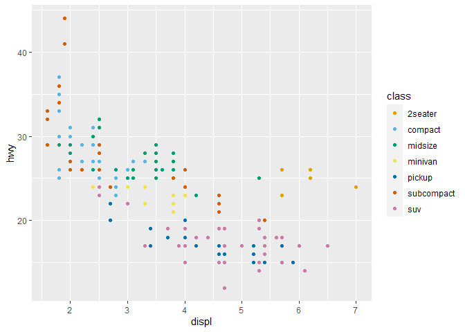
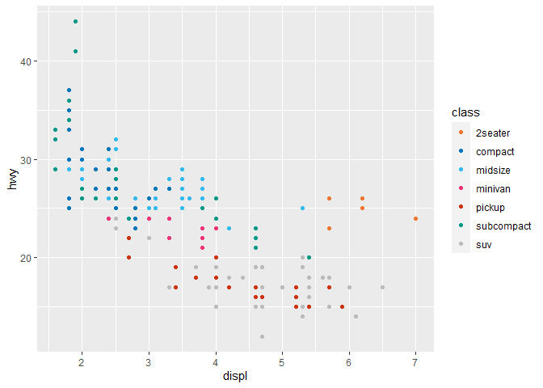
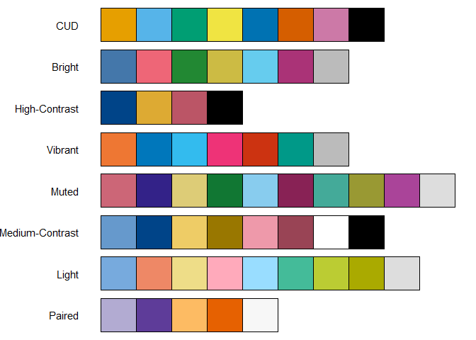
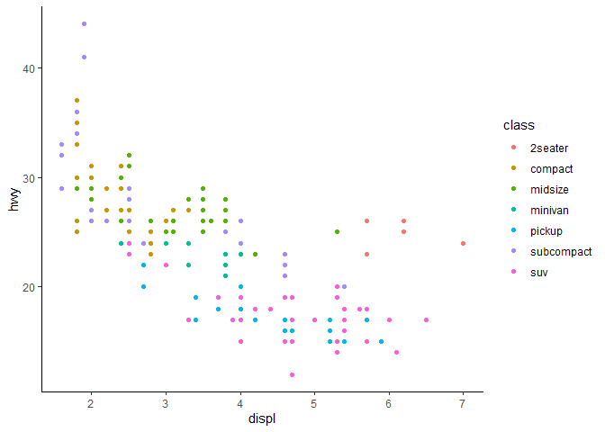

<!-- README.md is generated from README.Rmd. Please edit that file -->

# CMORplots

<!-- badges: start -->
<!-- badges: end -->

# Overview

The goal of CMORplots is to provides `ggplot` themes and colour schemes
for consistent figure formatting for CMOR outputs.

## Installation

You can install the latest version of CMORplots from
[GitHub](https://github.com/):

``` r
# install.packages("devtools")
devtools::install_github("uo-cmor/CMORplots")
```

## Example

CMORplots provides functions to extend
[ggplot2](https://github.com/tidyverse/ggplot2) with a selection of
colour palettes and plot themes to provide a consistent style for CMOR
outputs.

### Colour palettes

`scale_colour_cmor()` and `scale_fill_cmor()` provide access to several
selected colour palettes. All included colour palettes are colour-blind
friendly.

``` r
library(ggplot2)
library(CMORplots)

# By default, scale_colour_cmor() uses the 'Color Universal Design' palette (https://jfly.uni-koeln.de/color/#pallet)
ggplot(mpg, aes(displ, hwy, colour = class)) +
  geom_point() +
  scale_colour_cmor()
```



``` r
# This can be changed to an alternative colour scheme with the `palette` argument:
ggplot(mpg, aes(displ, hwy, colour = class)) +
  geom_point() +
  scale_colour_cmor(palette = "Vibrant")
```



To get a list of the available colour palettes by name, use
`list_cmor_colours()`, or generate a figure showing all available
colours:

``` r
plot_cmor_colours()
```



### Themes

The only theme currently included is CMOR Classic, which simply
replicates `theme_classic()` for now – tweaking of this theme and
addition of extra themes for specific use cases is planned.

``` r
ggplot(mpg, aes(displ, hwy, colour = class)) +
  geom_point() +
  theme_cmor_classic()
```


